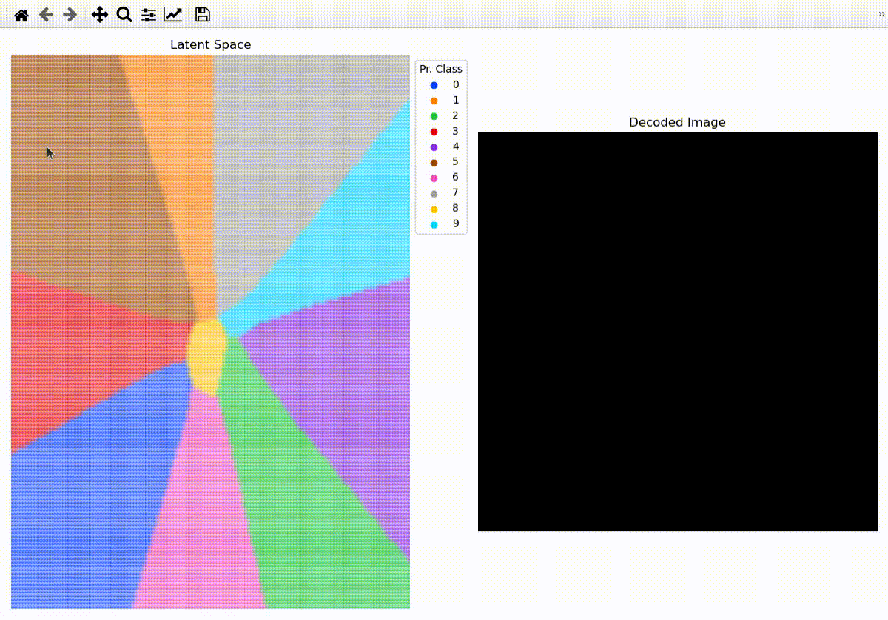

# Two Phase Supervised Encoder - (TP-SE)

This repository contains the experiment implementation of the [Two Phase Supervised Encoder](https://www.sciencedirect.com/science/article/abs/pii/S0031320323005691) for the MNIST dataset, with
the Python Programming Language and PyTorch Framework. 

## Usage

1. Clone the code to local machine.

```
git clone https://github.com/JohnNellas/TPSE-PyTorch.git
```

2. Move inside the cloned directory entitled ```TPSE-PyTorch```.

```
cd TPSE-PyTorch
```

3. Create the environment from the ```environment.yml``` file.

```
conda env create -f environment.yml
```

4. See the documentation of the main program ```main.py```.

```
python3 main.py --help

usage: main.py [-h] --mode MODE --latentSpaceDims LATENT_SPACE_DIMS [--rv REPORT_VALUE] [--weightPath PATH] [--epochs EPOCHS] [--batch_size BATCH_SIZE] [--lr LR] [--valSize VAL_SIZE] [--nPoints N_POINTS]
               [--nNeighbors N_NEIGHBORS] [--dpi DPI] [--format {jpg,png,pdf}] [--device DEVICE] [--experimentID EXPERIMENT_ID] [--zoom ZOOM] [--seedVal SEED_VAL] [--figSize WIDTH HEIGHT]

A python script for executing the experiment on MNIST dataset utilizing the Two Phase Supervised Encoder.

optional arguments:
  -h, --help            show this help message and exit
  --mode MODE           Run the experiment for training (t), evaluation (e) or both (te).
  --latentSpaceDims LATENT_SPACE_DIMS
                        The dimensionality of the latent space.
  --rv REPORT_VALUE     report training loss values to screen per rv batches, when training.
  --weightPath PATH     The path to the trained TP-SE weights for evaluation mode.
  --epochs EPOCHS       The number of epochs when training.
  --batch_size BATCH_SIZE
                        The batch size.
  --lr LR               The learning rate.
  --valSize VAL_SIZE    The portion of the training set used for validation when training.
  --nPoints N_POINTS    The number of points to sample per dimension in the 2D scatter plot of explainability.
  --nNeighbors N_NEIGHBORS
                        The number of nearest neighbors utilized for the kNN classifier when evaluating.
  --dpi DPI             The employed dpi when saving the generated figures.
  --format {jpg,png,pdf}
                        The format to save the generated figures (choices: png, jpg, pdf).
  --device DEVICE       The device to be utilized.
  --experimentID EXPERIMENT_ID
                        The identifier of the experiment.
  --zoom ZOOM           The zoom of the displayed images in the explainability 2D Scatter Plot.
  --seedVal SEED_VAL    The seed value.
  --figSize WIDTH HEIGHT
                        The figure size in inches.
```

### Additional Details
The experiment can be executed in the following modes: train (t), evaluation (e) 
along with train and evaluation mode (te). Additionally, concerning the weights, in train mode,
the weights achieving the best accuracy in the validation set during training are retained. Moreover,
in evaluation mode, the user is mandatory to provide the weights to be loaded for evaluation. In train and evaluation mode,
the weights achieving the best accuracy  in the validation set during training are utilized for evaluation.
Trained weights for latent space dimensionality of 2, 10 and 18 are additionally provided at the directory ```provided_tpse_weights_mnist```.
Finally, during script execution a folder structure is created to facilitate the best weights (for t and te modes)
along with classification and visualization results (for e and te modes).

### Examples
1. Train the Two Phase Supervised Encoder (TP-SE) for a latent space dimensionality of 2 and 200 epochs.
```
python3 main.py --mode t --latentSpaceDims 2 --epochs 200
```

2. Evaluate Two Phase Supervised Encoder (TP-SE) utilizing
the weights in ```PATH``` for a latent space
dimensionality equal to 2.
```
python3 main.py --mode e --weightPath PATH --latentSpaceDims 2
```

3. Train and evaluate Two Phase Supervised Encoder (TP-SE) for a latent space dimensionality of 2 and 200 epochs.
```
python3 main.py --mode te --latentSpaceDims 2 --epochs 200
```


## Visualization Tool
This repository also contains an interactive tool for 2D latent space exploration and image generation
with the Two Phase Supervised Encoder. A preview of the tool is displayed below.





The documentation of the tool is depicted below.

```
python3 vis.py --help
usage: vis.py [-h] --weightPath PATH [--xbounds X_MIN X_MAX] [--ybounds Y_MIN Y_MAX] [--nPoints NPOINTS] [--targetDirectory TARGETDIRECTORY] [--format {jpg,png,pdf}] [--device DEVICE] [--zoom ZOOM]
              [--figSize WIDTH HEIGHT]

A python script for performing 2D latent space exploration and image generation with TP-SE interactively.

optional arguments:
  -h, --help            show this help message and exit
  --weightPath PATH     The path to the trained TP-SE weights (2D latent space).
  --xbounds X_MIN X_MAX
                        The min and max values for the x-axis.
  --ybounds Y_MIN Y_MAX
                        The min and max values for the y-axis.
  --nPoints NPOINTS     The number of points to obtain between the specified min max intervals.
  --targetDirectory TARGETDIRECTORY
                        The target directory to save the generated figures (if it does not exist, it will be created).
  --format {jpg,png,pdf}
                        The format to save the generated figures (choices: png, jpg, pdf).
  --device DEVICE       The desired device to be utilized.
  --zoom ZOOM           The zoom utilized for the decoded images.
  --figSize WIDTH HEIGHT
                        The figure size in inches.
```

### Controls
The controls for the interactive tool are the following:
- b key: decode latent representation under cursor.
- n key: display already decoded image under the cursor.
- m key: save the already decoded image under the cursor at ```targetDirectory```.

### Example
Start the interactive tool for 2D latent space exploration and image generation utilizing the weights
facilitated at PATH.
```
python3 vis.py --weightPath PATH
```

## Citation

If you find the Two Phase Supervised Encoder useful in your research, please consider citing:
```BibTeX
@article{NELLAS2023109871,
title = {Two phase cooperative learning for supervised dimensionality reduction},
journal = {Pattern Recognition},
volume = {144},
pages = {109871},
year = {2023},
issn = {0031-3203},
doi = {https://doi.org/10.1016/j.patcog.2023.109871},
url = {https://www.sciencedirect.com/science/article/pii/S0031320323005691},
author = {Ioannis A. Nellas and Sotiris K. Tasoulis and Spiros V. Georgakopoulos and Vassilis P. Plagianakos},
keywords = {Artificial neural networks, Deep learning, Dimensionality reduction, Autoencoders, Image classification}
}
```
